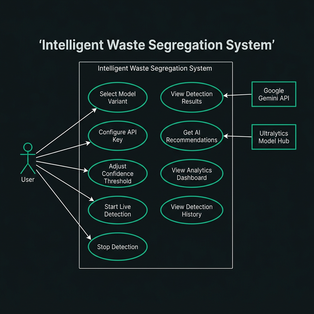
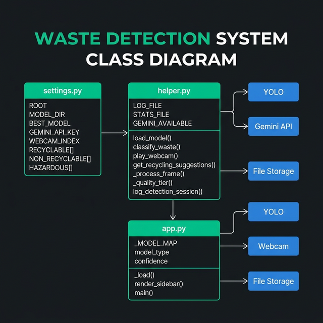
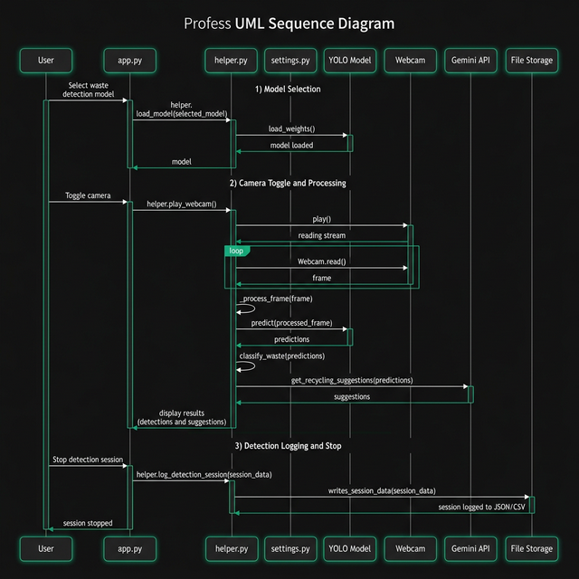
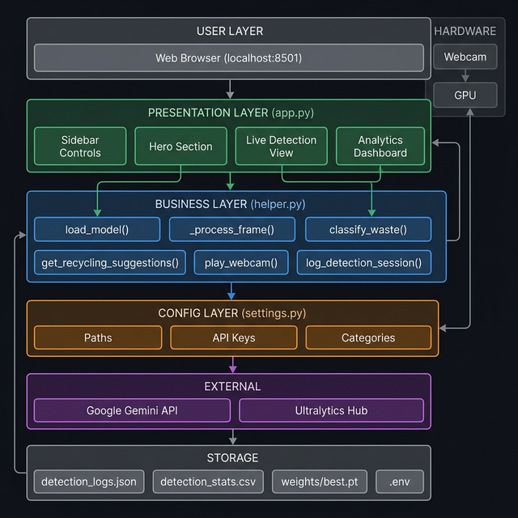
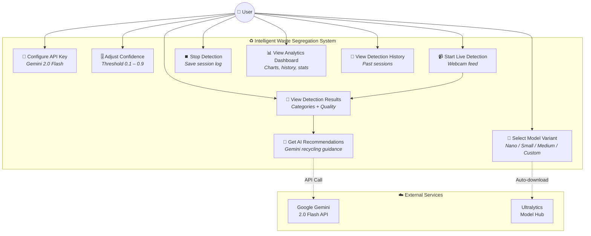
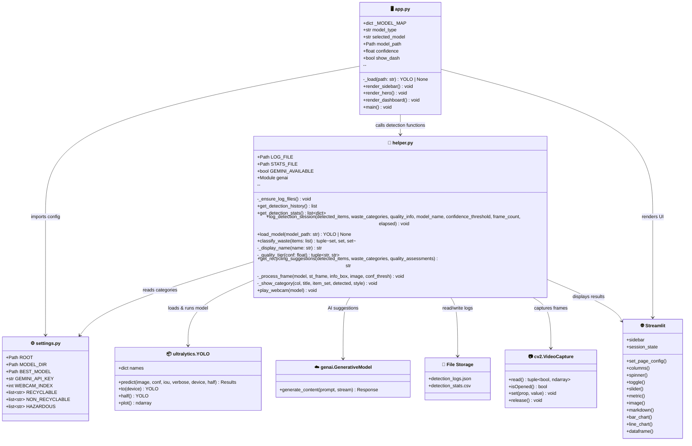
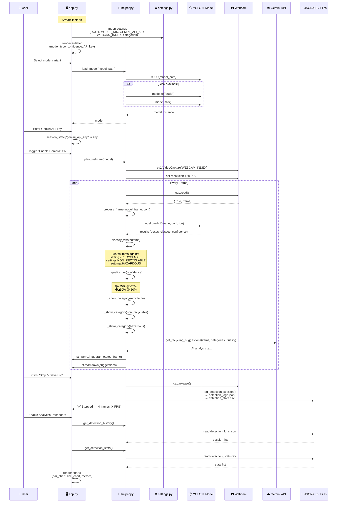

# 📐 System Diagrams — Intelligent Waste Segregation System

> All diagrams reflect the actual codebase: `app.py`, `helper.py`, `settings.py`

### 🖼️ Visual Diagram References

| Diagram | Preview |
|---------|---------|
| Use Case |  |
| Class Diagram |  |
| Sequence Diagram |  |
| System Architecture |  |

## 1️⃣ Use Case Diagram

---

## 2️⃣ UML Class Diagram

---

## 3️⃣ Sequence Diagram

---

## 4️⃣ System Architecture Diagram

```mermaid
flowchart TB
    subgraph UserLayer["👤 USER LAYER"]
        Browser["🌐 Web Browser<br/><i>http://localhost:8501</i>"]
    end

    subgraph PresentationLayer["🖥️ PRESENTATION LAYER — app.py"]
        direction TB
        PageConfig["Page Config<br/><i>set_page_config()</i><br/><i>Custom CSS / Inter font</i>"]
        Sidebar["Sidebar Controls<br/><i>Model selector</i><br/><i>Confidence slider</i><br/><i>API key input</i><br/><i>Waste categories</i><br/><i>System info</i>"]
        Hero["Hero Section<br/><i>Title + feature table</i>"]
        LiveView["Live Detection View<br/><i>Annotated video frame</i><br/><i>Category breakdown</i><br/><i>AI recommendations</i>"]
        Dashboard["Analytics Dashboard<br/><i>Metrics cards</i><br/><i>Bar chart</i><br/><i>Line chart</i><br/><i>Top items table</i>"]
        History["Detection History<br/><i>Recent sessions</i><br/><i>Item statistics</i>"]
    end

    subgraph BusinessLayer["🔧 BUSINESS LAYER — helper.py"]
        direction TB
        ModelLoader["load_model()<br/><i>YOLO loading + GPU opt</i>"]
        FrameProcessor["_process_frame()<br/><i>Resize → Predict → Classify</i>"]
        Classifier["classify_waste()<br/><i>Set intersection with categories</i>"]
        QualityScore["_quality_tier()<br/><i>Confidence → tier mapping</i>"]
        AIEngine["get_recycling_suggestions()<br/><i>Gemini prompt + response</i>"]
        WebcamLoop["play_webcam()<br/><i>Frame capture loop</i>"]
        Logger["log_detection_session()<br/><i>JSON + CSV persistence</i>"]
        HistoryReader["get_detection_history()<br/>get_detection_stats()"]
    end

    subgraph ConfigLayer["⚙️ CONFIG LAYER — settings.py"]
        Paths["Paths<br/><i>ROOT, MODEL_DIR, BEST_MODEL</i>"]
        APIKey["API Keys<br/><i>GEMINI_API_KEY from .env</i>"]
        Camera["Camera<br/><i>WEBCAM_INDEX = 0</i>"]
        Categories["Waste Categories<br/><i>RECYCLABLE: 43 items</i><br/><i>NON_RECYCLABLE: 17 items</i><br/><i>HAZARDOUS: 10 items</i>"]
    end

    subgraph ExternalLayer["☁️ EXTERNAL SERVICES"]
        GeminiAPI["Google Gemini 2.0 Flash<br/><i>gemini-2.0-flash model</i><br/><i>generativeai SDK</i>"]
        UltralyticsHub["Ultralytics Hub<br/><i>YOLO11 model download</i>"]
    end

    subgraph HardwareLayer["🔌 HARDWARE"]
        Webcam["📷 Webcam<br/><i>cv2.VideoCapture</i><br/><i>1280×720 @ 30fps</i>"]
        GPU["⚡ GPU (optional)<br/><i>CUDA 11.8+</i><br/><i>FP16 half precision</i>"]
    end

    subgraph StorageLayer["💾 FILE STORAGE"]
        JSONLog["detection_logs.json<br/><i>Session history</i>"]
        CSVStats["detection_stats.csv<br/><i>Item statistics</i>"]
        ModelWeights["weights/best.pt<br/><i>Custom YOLO model 6.2 MB</i>"]
        EnvFile[".env<br/><i>GEMINI_API_KEY</i><br/><i>gitignored</i>"]
    end

    Browser <--> PresentationLayer
    PresentationLayer --> BusinessLayer
    BusinessLayer --> ConfigLayer
    Sidebar --> ModelLoader
    LiveView --> FrameProcessor
    Dashboard --> HistoryReader
    History --> HistoryReader

    ModelLoader --> UltralyticsHub
    ModelLoader --> ModelWeights
    ModelLoader --> GPU
    FrameProcessor --> Classifier
    FrameProcessor --> QualityScore
    FrameProcessor --> AIEngine
    WebcamLoop --> FrameProcessor
    WebcamLoop --> Webcam
    AIEngine --> GeminiAPI
    Logger --> JSONLog
    Logger --> CSVStats
    HistoryReader --> JSONLog
    HistoryReader --> CSVStats
    APIKey --> EnvFile
    Classifier --> Categories

    style UserLayer fill:#1a1a2e,stroke:#00C896,color:#fff
    style PresentationLayer fill:#16213e,stroke:#00C896,color:#fff
    style BusinessLayer fill:#0f3460,stroke:#00C896,color:#fff
    style ConfigLayer fill:#1a1a2e,stroke:#FFB84D,color:#fff
    style ExternalLayer fill:#2d1b69,stroke:#7B68EE,color:#fff
    style HardwareLayer fill:#1b2838,stroke:#4FC3F7,color:#fff
    style StorageLayer fill:#1b3a1b,stroke:#66BB6A,color:#fff
```

---

## 📝 Notes

### Storage (No Database)
This project uses **flat-file storage**, not a database:
- **`detection_logs.json`** — complete session data (JSON array)
- **`detection_stats.csv`** — aggregated item counts (CSV table)

No MongoDB, PostgreSQL, or any other database is required.

### File Responsibilities

| File | Role | Key Functions |
|------|------|--------------|
| **`app.py`** | Frontend / UI | Page config, sidebar, model loading, dashboard rendering |
| **`helper.py`** | Backend / Engine | YOLO inference, Gemini AI, webcam loop, logging |
| **`settings.py`** | Configuration | Paths, API keys, camera index, waste category lists |
| **`.env`** | Secrets | `GEMINI_API_KEY` (gitignored) |
